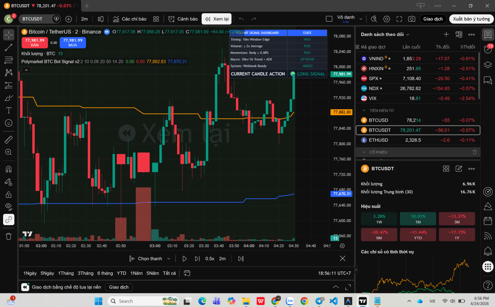

# 📈 VQuant - Polymarket BTC Up/Down Automated Trading Bot

> **Institutional-Grade Automated Trading Architecture bridging TradingView Analytics with Polymarket Decentralized Prediction Markets on the Polygon Blockchain.**

---

## 🧭 Project Overview

This repository contains the architecture, documentation, and the proprietary **Pine Script v6 Engine** for a fully automated trading system built by **VQuant Engineering**.

The system targets the **Polymarket BTC Up/Down (5-Minute Cycle)**, a highly volatile derivative market that demands millisecond execution speed and absolute timing precision. By integrating TradingView's advanced charting capabilities with a custom Python webhook gateway, the system programmatically detects highly probable setups and injects digital signatures directly into Polymarket's Smart Contracts.

### 🧠 Core Components
1. **Analytics Tier (TradingView)**: Real-time 2-minute (2m) market scanning to detect ultra-early signals.
2. **Processing Tier (Python Flask Gateway)**: Deployed on Railway. Manages dynamic risk, position sizing, and webhook duplication guards.
3. **Execution Tier (Polygon Blockchain)**: Integrates `py-clob-client` for Zero-Delay Fill-or-Kill (FOK) order execution.

---

## 📊 Product Showcase


*Real-time TradingView Dashboard (VQuant Signal Engine) dynamically tracking Volume Vectors, MTF Trend alignments, and Timing Logic before dispatching execution signatures to the Polymarket Protocol.*

---

## 🏗️ System Architecture

```text
[TradingView Analytics (2m)] → Detects ultra-early signals (Volume Vector, MTF Trend).
  ▼
[Pine Script v6 Webhook]     → Fires signal ONLY after full confirmation.
  ▼
[Python Flask Gateway]       → Checks Balance, Manages Risk & Position Sizing.
  ▼
[Polymarket / Polygon RPC]   → FOK Pipeline: Market Order BTC Up/Down (Ask < 0.85).
  ▼
[Blockchain Ledger]          → Transaction successful, outputs TxID logging.
```

---

## 💻 Engine Mechanics

### Phase 1: Pine Script Signal Engine (TradingView)
The algorithmic core built in Pine Script v6 prevents blind trading by mathematically validating setups before firing webhooks:
- **Zero-Repaint Guarantee**: Enforces `barstate.isconfirmed = true` ensuring the system only flags when the candle cycle is perfectly frozen.
- **Precision Timing Modulo**: Implements `minute(time, syminfo.timezone) % 10 == 0` to execute orders exactly at the opening edge of Polymarket's 5-minute cycles (00, 10, 20...).
- **Volume Vector Filter**: Triggers only when the current candle's volume exceeds 200% compared to the 10-candle SMA.
- **MTF Trend Filter**: Built-in Multi-Timeframe security requests ensure signals align with the broader macroeconomic trend (30m EMA > 1h EMA).
- **Anti-Future-Leak**: `lookahead=barmerge.lookahead_off` strictly disables future data peaking.

*(Pine Script source files are located in the `Phase1/` directory).*

### Phase 2: Execution Gateway (Python / Railway)
A high-throughput API catching incoming TradingView Webhooks:
- **Dual-Cache Risk Firewall**: SHA-256 caching instantly rejects duplicate webhooks.
- **Dynamic Position Sizing**: Real-time balance queries via `py-clob-client`, aggressively controlling exposure by sizing trades at exactly 2.5% of total liquidity.
- **FOK Price Ceiling Limit**: Discards execution instantly if the token Ask Price exceeds the risk-reward threshold (> $0.85).
- **Polymarket On-Chain FOK Execution**: Robust 2-Retry architecture bypassing transient Polygon network congestion and latency.

---

## 📂 Repository Structure

```text
.
├── Phase1/                                      # Pine Script Algorithms
│   ├── polymarket_btc_bot_pine.pine             # V1 Script
│   ├── polymarket_btc_bot_pine_v2.pine          # V2 Script (Production)
│   ├── polymarket_btc_bot_strategy.pine         # Backtesting Strategy Version
│   └── VQuant_Phase1_Completion_Report.html     # Client Phase 1 Delivery Report
├── nhiem_vu_ky_thuat_polymarket_bot.txt         # Technical Requirements & Architecture Rules
├── VQuant_Project_Delivery_Plan_EN.html         # Delivery Plan (English)
├── VQuant_Ke_Hoach_Bao_Cao_Polymarket.html      # Delivery Plan (Vietnamese)
├── VQuant — Polymarket BTC Up_Down Bot...pdf    # Comprehensive PDF Documentation
└── README.md                                    # Project Overview
```

---

## 🚀 Deployment Snapshot
The bot gateway is designed to be fully containerized (Nixpacks/Railway):
```toml
# railway.toml (Infrastructure Build)
[build]
builder = "nixpacks"
[deploy]
startCommand = "python app.py"
healthcheckPath = "/health"
restartPolicyType = "always"
```

---

*This repository serves as an architectural portfolio piece demonstrating institutional-grade quantitative development and automated system integration by VQuant.*
